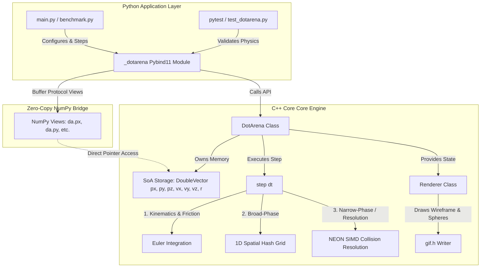

# DotArena: Architectural Design Document

This document outlines the software architecture, memory layout, and optimization strategies implemented in the **DotArena** 3D physics engine. The engine is written in performance-critical C++ with high-level Python bindings provided via Pybind11.

---

## 1. System Architecture Overview

DotArena is designed as a hybrid system:
- **C++ Backend**: Handles memory allocation, integration, spatial partitioning, and SIMD-accelerated collision resolution.
- **Python Frontend**: Used for initialization, testing, configuration, and visualization (rendering simulation state to animated GIFs).



---

## 2. Memory Architecture: Structure of Arrays (SoA) vs. Array of Structures (AoS)

To achieve high-performance physics simulation ($N > 10^4$ bodies), DotArena utilizes a **Data-Oriented Design (DOD)** pattern, specifically **Structure of Arrays (SoA)**, instead of the object-oriented **Array of Structures (AoS)**.

### Traditional AoS Layout (Object-Oriented)
In a typical OOP implementation, each particle is represented by a `class` or `struct` object:

```cpp
struct Particle {
    int id;
    double radius;
    double px, py, pz;
    double vx, vy, vz;
    double mass;
    bool is_alive;
};
std::vector<Particle> particles;
```
* **Performance Drawback**: When updating positions or performing collision checking, the CPU iterates over `particles`. It loads the entire `Particle` struct (typically $\ge 64$ bytes) into the CPU cache line. If only `px`, `py`, and `pz` are needed, unused fields like `id` and `is_alive` pollute the L1/L2 caches, leading to frequent cache misses and wasted bandwidth.

### SoA Layout (Data-Oriented)
DotArena stores particle fields in separate, contiguous, cache-aligned vectors:

```cpp
class DotArena {
private:
    std::vector<int> ids;
    DoubleVector px, py, pz;
    DoubleVector vx, vy, vz;
    DoubleVector radius;
};
```
* **Performance Benefit**: 
  - **Sequential Access / Cache Locality**: During the kinematics step, the CPU reads and writes to `px`, `py`, `pz`, `vx`, `vy`, and `vz` in contiguous, sequential chunks of memory. This maximizes L1/L2 cache line utilization (each 64-byte cache line is fully packed with the double-precision values being computed).
  - **SIMD Friendly**: Parallel vectors match the layout needed for vector registers. We can load consecutive floating-point values directly into vector registers (e.g., loading two `double` coordinates at once into a 128-bit SIMD register) without needing complex gather/scatter instructions.

---

## 3. Zero-Copy Python-C++ Memory Bridge

One of the primary engineering constraints of Python-C++ hybrid applications is the serialization and copy overhead when passing large arrays (such as $10^5$ particle coordinates) between the languages.

DotArena solves this using the **NumPy Buffer Protocol** via Pybind11:

```cpp
.def_property_readonly("px", [](DotArena &da) {
    return pybind11::array_t<double>(
        {da.getNumCircles()},   // Shape
        {sizeof(double)},       // Strides
        da.getPx().data(),      // Raw C++ pointer
        pybind11::cast(&da)     // Parent reference (keeps da alive)
    );
})
```

### Key Mechanics:
1. **Direct Pointer Exposure**: The `pybind11::array_t` wraps the raw memory address returned by `da.getPx().data()`. 
2. **Zero Overhead ($O(1)$)**: Python accesses this memory address directly. Modifying `da.px[0] = 50.0` in a Python script writes directly to the memory owned by the C++ `std::vector` inside the `DotArena` instance.
3. **Reference Counting & Lifecycle Safety**: The `pybind11::cast(&da)` argument ensures that Python's garbage collector will not destroy the parent C++ `DotArena` object while a NumPy array view (`px`, `py`, etc.) is still referenced in Python.

---

## 4. Collision Optimization Pipeline

Collision resolution is divided into two phases: **Broad-Phase** (to quickly eliminate pairs that are far apart) and **Narrow-Phase** (to perform precise intersection tests and resolve velocities).

### 4.1 Broad-Phase: 1D Spatial Hashing Grid
Instead of checking all $O(N^2)$ particle pairs, the simulation arena is divided into a grid of uniform cells.

1. **Cell Indexing**: A particle's coordinates $(x, y, z)$ are mapped to a 3D grid cell:
   $$cx = \lfloor \frac{x + s_x}{\text{cell\_size}} \rfloor, \quad cy = \lfloor \frac{y + s_y}{\text{cell\_size}} \rfloor, \quad cz = \lfloor \frac{z + s_z}{\text{cell\_size}} \rfloor$$
   This is flattened to a 1D hash index:
   $$\text{index} = cz \cdot W \cdot H + cy \cdot W + cx$$
2. **No Allocation LinkedList**: To avoid allocating memory during steps, the grid is built using a flat head array (`grid_head`) and a next-pointer array (`circle_next`):
   ```cpp
   for (size_t i = 0; i < num_circles; ++i) {
       int cell_idx = getCellIndex(i);
       circle_next[i] = grid_head[cell_idx];
       grid_head[cell_idx] = i; // Point head to current particle
   }
   ```
3. **Neighbor Lookup**: For each particle, only the particles residing in its current cell and the 26 adjacent neighbor cells are checked for collisions.

### 4.2 Narrow-Phase: ARM NEON SIMD Acceleration
Once candidate pairs are identified, their distance calculations are vectorized using **ARM NEON SIMD** instructions.

For a particle $i$ and neighbors $j_0, j_1$:
1. Coordinates of $i$ are duplicated across a 128-bit vector register (`float64x2_t`):
   - `pxi = [px[i], px[i]]`
   - `pyi = [py[i], py[i]]`
   - `pzi = [pz[i], pz[i]]`
2. Coordinates of $j_0$ and $j_1$ are loaded together:
   - `pxj = [px[j0], px[j1]]`
   - `pyj = [py[j0], py[j1]]`
   - `pzj = [pz[j0], pz[j1]]`
3. Vector subtraction and fused multiply-add calculate the squared distance:
   - `dx = pxi - pxj`
   - `distSq = dx * dx + dy * dy + dz * dz`
4. The squared distance vector is compared against the squared sum of the radii vector (`rSumSq`).
5. A comparison mask extracts collisions, and velocities are updated via classical 3D elastic momentum resolution.

---

## 5. Architectural Modularity Summary

- **`Arena`** ([arena.hpp](file:///Users/cheng/Desktop/OSCAR/DotArena/include/arena.hpp)): Responsible for physical boundary dimensions and global environment parameters (friction coefficient).
- **`DotArena`** ([dotarena.hpp](file:///Users/cheng/Desktop/OSCAR/DotArena/include/dotarena.hpp)): The central engine that owns particle state arrays (SoA layout), manages spatial hashing broad-phase partitioning, and runs collision narrow-phase solvers.
- **`Renderer`** ([renderer.hpp](file:///Users/cheng/Desktop/OSCAR/DotArena/include/renderer.hpp)): Responsible for 3D-to-2D projection mapping, depth sorting (painter's algorithm to render spheres back-to-front), lighting calculation, and encoding frame buffers into GIF files.
